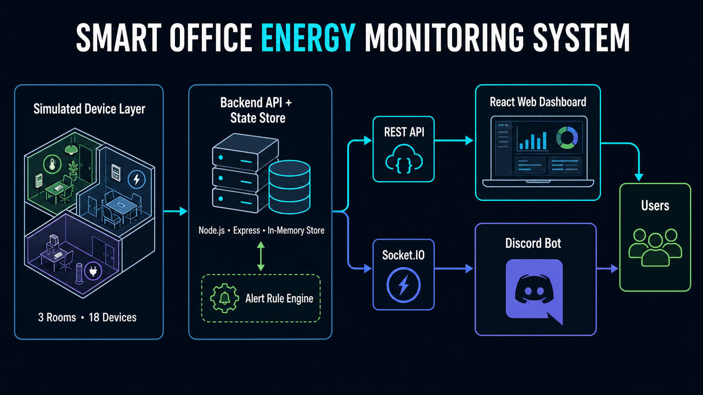

# Smart Office Energy Monitoring System


A hackathon-ready smart office platform that monitors simulated lights and fans, calculates live energy consumption, detects wasteful usage, and presents the same information through a React dashboard and a Discord bot.

The system models three rooms—**Drawing Room**, **Work Room 1**, and **Work Room 2**—with two fans and four lights in each room. That gives six devices per room and **18 devices** in total. The backend is their single source of truth; no physical hardware is required to run the project.

## Problem Statement

Office devices are often left running when they are not needed, wasting energy and making consumption difficult to understand. Traditional monitoring also tends to fragment information across separate tools.

This project provides one shared, real-time view of office energy use. Simulated device activity flows through a central backend to both a visual web dashboard and a conversational Discord interface, helping users spot unnecessary usage quickly.

## Key Features

- Monitors 18 simulated devices across three rooms
- Shows live and room-wise device status
- Calculates total power and per-room power consumption
- Displays active energy alerts
- Pushes real-time dashboard updates with Socket.IO—no manual refresh required
- Simulates realistic office activity over time
- Provides an interactive top-view office visualization
- Answers room, status, and usage questions through Discord
- Sends newly detected alerts to a configured Discord channel
- Keeps the dashboard and Discord bot synchronized through one backend
- Supports mock fallback data for demonstrations when the backend is unavailable

## System Architecture

```text
Simulated Device Layer
          │
          ▼
Backend API + In-Memory State Store
          │
          ├──────── REST API ────────┐
          └──── Socket.IO events ────┤
                                     ▼
                         Web Dashboard + Discord Bot
                                     │
                                     ▼
                                   Users
```

The simulator changes device states in the shared in-memory store. The Node.js backend recalculates usage and alerts, exposes snapshots through REST endpoints, and broadcasts updates through Socket.IO. The React dashboard and Discord bot both consume this backend data, so their readings remain consistent.

### Architecture Diagram



## Hardware Reference

Physical hardware is **not required** to run this repository. The current hardware documentation describes a reduced, one-room ESP32 prototype with three light indicators, two fan indicators, and five manual switches. It is a proof of concept for the simulated 18-device office, not a one-to-one copy of the backend inventory.

- Switch inputs: GPIO 13, 12, 14, 27, and 26 using `INPUT_PULLUP`
- Light outputs: GPIO 18, 19, and 21
- Fan outputs: GPIO 22 and 23
- Real AC lights and fans must use properly isolated relay modules or contactors
- An ACS712 or CT sensor can be added for current and power measurement

See the complete [ESP32 pin mapping and electrical notes](docs/pin-mapping-table.md), which is the repository's current hardware reference.

## Technology Stack

| Layer | Technology | Purpose |
| --- | --- | --- |
| Backend | Node.js, Express | Central API and application state |
| Real-time | Socket.IO | Live device, usage, and alert updates |
| Frontend | React, Vite, CSS, SVG | Responsive monitoring dashboard |
| Discord bot | discord.js, Socket.IO Client | Commands and live alert delivery |
| Data | In-memory simulated data | Shared 18-device state |
| Hardware concept | ESP32 | Representative one-room pin and connection plan |

## Folder Structure

```text
Arpita-s-hackathon/
├── backend/
│   ├── src/
│   │   ├── data/
│   │   ├── realtime/
│   │   ├── routes/
│   │   ├── scripts/
│   │   ├── services/
│   │   ├── simulator/
│   │   ├── store/
│   │   └── server.js
│   └── .env.example
├── frontend/
│   ├── src/
│   └── .env.example
├── bot/
│   ├── commands/
│   ├── services/
│   ├── discordBot.js
│   └── .env.example
├── docs/
│   ├── system-diagram.png
│   └── pin-mapping-table.md
└── README.md
```

## Run Locally

### Prerequisites

- Node.js 18 or newer
- npm
- A Discord application and bot token only if running the Discord integration

Clone the repository, then start each service in a separate terminal. Start the backend first so the other clients can connect to it.

### 1. Backend Setup

```bash
cd backend
cp .env.example .env
npm install
npm run dev
```

The backend starts at `http://localhost:5000` by default.

### 2. Frontend Setup

```bash
cd frontend
cp .env.example .env
npm install
npm run dev
```

Open `http://localhost:5173` in a browser.

### 3. Discord Bot Setup

```bash
cd bot
cp .env.example .env
npm install
npm start
```

Create a bot in the [Discord Developer Portal](https://discord.com/developers/applications), enable **Message Content Intent**, invite it to the test server, and place its credentials in `bot/.env`.

## Environment Variables

Copy the relevant `.env.example` file to `.env` before starting each service. Keep local values out of version control.

### Backend — `backend/.env`

```env
PORT=5000
FRONTEND_ORIGIN=http://localhost:5173
OFFICE_START_HOUR=9
OFFICE_END_HOUR=17
SIMULATOR_INTERVAL_MS=7000
DEVICE_ON_TIMEOUT_MINUTES=120
ROOM_FULLY_ON_TIMEOUT_MINUTES=120
HIGH_POWER_THRESHOLD_W=250
```

### Frontend — `frontend/.env`

```env
VITE_BACKEND_URL=http://localhost:5000
```

### Discord Bot — `bot/.env`

```env
DISCORD_BOT_TOKEN=
DISCORD_CLIENT_ID=
DISCORD_GUILD_ID=
ALERT_CHANNEL_ID=
BACKEND_API_URL=http://localhost:5000
BACKEND_SOCKET_URL=http://localhost:5000
COMMAND_PREFIX=!
ALERT_POLL_INTERVAL_MS=30000
MOCK_MODE=false
ANTHROPIC_API_KEY=
LLM_MODEL=claude-haiku-4-5-20251001
```

`ANTHROPIC_API_KEY` and `LLM_MODEL` are optional. Without them, the bot uses its built-in response templates and all core commands continue to work.

## API Endpoints

Base URL: `http://localhost:5000`

| Method | Canonical endpoint | Alias | Description |
| --- | --- | --- | --- |
| `GET` | `/health` | — | Check backend health and device count |
| `GET` | `/api/devices` | `/devices` | Return all 18 device snapshots |
| `GET` | `/api/rooms` | `/rooms` | Return summaries for all three rooms |
| `GET` | `/api/rooms/:roomName` | `/room/:roomName` | Return one room using its name or alias |
| `GET` | `/api/usage` | `/usage` | Return total and per-room power usage |
| `GET` | `/api/alerts` | `/alerts` | Return active smart alerts |
| `GET` | `/api/status` | — | Return a human-friendly office summary |
| `POST` | `/api/devices/:id/toggle` | — | Toggle a device on or off |
| `POST` | `/api/devices/:id/status` | — | Set a device to `ON` or `OFF` |

## Discord Bot Commands

| Command | Description |
| --- | --- |
| `!ping` | Confirm that the Discord bot is online |
| `!status` | Show a concise status summary for all rooms |
| `!room drawing` | Show Drawing Room devices and power usage |
| `!room work1` | Show Work Room 1 devices and power usage |
| `!room work2` | Show Work Room 2 devices and power usage |
| `!usage` | Show total usage and the highest-consuming rooms |

**Discord bot responses are generated from live backend API data, not hardcoded values.** With `MOCK_MODE=false`, the bot and dashboard read from the same source of truth. The bot can also monitor backend alerts through Socket.IO and polling.

## Suggested Demo Flow

1. Start the backend, frontend, and Discord bot.
2. Show that `/devices` returns 18 devices and `/rooms` returns three rooms.
3. Open the dashboard and point out the live connection badge, room cards, floor plan, power breakdown, and alert panel.
4. Wait for a simulator tick or toggle a device through the API.
5. Show the dashboard changing immediately without a refresh.
6. Run `!status`, `!room work1`, and `!usage` in Discord.
7. Compare the dashboard and Discord values to demonstrate that both use the same backend.
8. Temporarily lower an alert threshold to demonstrate a live dashboard and Discord alert.
9. Present the ESP32 pin map as the path from simulation to a future physical prototype.

## Testing Checklist

- [ ] Backend starts on `localhost:5000`
- [ ] `/devices` returns 18 devices
- [ ] `/rooms` returns three room summaries
- [ ] `/usage` returns total power
- [ ] Simulator changes device states over time
- [ ] Dashboard updates without refresh
- [ ] Discord bot replies to `!status`
- [ ] Discord bot replies to `!room`
- [ ] Discord bot replies to `!usage`
- [ ] Dashboard and bot show the same backend data
- [ ] `.env` is not committed

Run the included automated checks as well:

```bash
cd backend
npm run verify
npm run validate
```

```bash
cd frontend
npm run build
```

For more detail, see the [backend](backend/README.md), [frontend](frontend/README.md), and [Discord bot](bot/README.md) guides.

## Security Notes

> **Never commit `.env` files or Discord bot tokens. If a token is exposed, regenerate it immediately from the Discord Developer Portal.**

- Commit only safe `.env.example` templates with blank secrets.
- Do not paste credentials into source files, screenshots, issues, or chat messages.
- Restrict the bot to the permissions and channels it needs.
- Use environment-specific CORS settings outside local development.

## Future Improvements

- Connect physical ESP32/Arduino relays and smart meters
- Persist historical readings in a database
- Add authentication and role-based device control
- Add daily and weekly cost, carbon, and usage analytics
- Add configurable schedules and anomaly detection
- Package the dashboard, API, and bot for production deployment

## Team Contributions

| Contributor | Contribution summary |
| --- | --- |
| Amio-27 | Core project foundation and frontend/backend organization |
| HishamXS420 | Discord bot integration, hackathon documentation work, and simulator logging improvements |
| Project team | Architecture, integration testing, dashboard/bot data consistency, hardware concept, and demo preparation |

Contribution summaries are based on the repository history and can be expanded with full member names and presentation roles before submission.

---

Built as a hackathon demonstration of real-time energy visibility, shared data, and multi-channel office monitoring.
