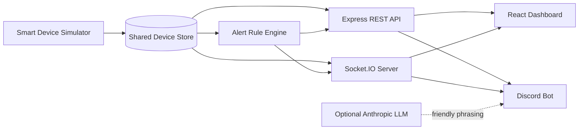

# ⚡ Smart Office Energy Monitoring System


A full-stack smart office solution that monitors lights and fans, calculates live energy consumption, detects wasteful usage, and delivers the same real-time information through both a web dashboard and a Discord bot.

The system models **3 rooms and 18 devices**. A shared backend acts as the single source of truth, while REST APIs provide reliable snapshots and Socket.IO pushes live changes to every connected client.

## ✨ What the Project Does

- Monitors **18 lights and fans** across Drawing Room, Work Room 1, and Work Room 2
- Displays live device status and room-wise power consumption
- Visualizes the office through an interactive top-view floor plan
- Animates running fans and active lights for quick visual feedback
- Tracks recent power changes through a rolling trend chart
- Simulates realistic office activity based on the time of day
- Detects after-hours usage, long-running devices, fully active rooms, and high power consumption
- Sends live alerts and energy summaries to Discord
- Keeps the dashboard and bot synchronized through one shared backend
- Continues to demonstrate the UI and bot using mock data when the backend is unavailable

## 🧩 System Architecture



### Data flow

1. The simulator or a manual API request updates the shared in-memory device store.
2. The backend recalculates power usage and active alerts.
3. Socket.IO immediately broadcasts the latest state.
4. The React dashboard updates without a page refresh.
5. The Discord bot reads the same data and posts newly detected alerts.

## 🖥️ Dashboard Highlights

- Live connection, reconnecting, disconnected, and mock-mode indicators
- Overview, Details, and combined display modes
- Responsive room cards with active fan/light counts
- Interactive SVG floor plan with keyboard-accessible device inspection
- Live office and room power meters
- Recent power trend with the latest 100 readings
- Backend-powered alert panel with a local demo fallback
- Automatic REST resynchronization after a Socket.IO reconnect
- Reduced-motion support and mobile-friendly layout

## 🤖 Discord Bot Commands

The command prefix is `!` by default and can be changed through `COMMAND_PREFIX`.

| Command | Description |
| --- | --- |
| `!ping` | Checks whether the bot is online |
| `!status` | Shows a concise status summary for all rooms |
| `!room drawing` | Shows the devices and usage in the Drawing Room |
| `!room work1` | Shows the devices and usage in Work Room 1 |
| `!room work2` | Shows the devices and usage in Work Room 2 |
| `!usage` | Shows total power, the highest-consuming room, and estimated daily usage |

The bot also watches backend alerts using Socket.IO and periodic polling. Each alert is posted only once to the configured Discord channel.

An Anthropic API key is optional. When provided, the bot can turn factual responses into short, friendly messages without changing the underlying numbers. Without a key, deterministic built-in templates are used.

## 🚨 Smart Alert Rules

| Alert | Trigger |
| --- | --- |
| After-hours usage | One or more devices remain ON outside configured office hours |
| Continuous runtime | A device stays ON longer than the configured limit |
| Fully active room | Every device in a room stays ON beyond the configured limit |
| High power usage | Combined office load reaches the configured watt threshold |

Alerts are normalized and deduplicated before being sent to the dashboard or Discord.

## 🛠️ Technology Stack

| Layer | Technologies |
| --- | --- |
| Frontend | React, Vite, Socket.IO Client, CSS, SVG |
| Backend | Node.js, Express, Socket.IO, CORS, dotenv |
| Bot | Discord.js, Socket.IO Client, optional Anthropic SDK |
| Data | Shared in-memory store with bundled mock datasets |
| Communication | REST API + real-time WebSocket/polling transport |

## 📁 Project Structure

```text
Arpita-s-hackathon/
├── frontend/                 # React dashboard
│   ├── src/components/       # Map, room cards, alerts, meters and charts
│   ├── src/hooks/            # REST + Socket.IO synchronization
│   ├── src/services/         # Backend API and socket clients
│   └── src/data/             # Frontend fallback data
├── backend/                  # Shared application backend
│   └── src/
│       ├── data/             # Initial 18-device inventory
│       ├── routes/           # REST endpoints
│       ├── simulator/        # Time-aware office activity simulator
│       ├── realtime/         # Socket.IO event broadcasting
│       ├── services/         # Snapshots and alert rules
│       └── store/            # Single source of truth
├── bot/                      # Discord bot
│   ├── commands/             # ping, status, room and usage commands
│   └── services/             # API, socket, formatting, mock and LLM helpers
└── README.md
```

## 🚀 Run Locally

### Prerequisites

- [Node.js](https://nodejs.org/) **18 or newer**
- npm
- A Discord bot token only if you want to run the Discord integration

### 1. Clone the repository

```bash
git clone <your-repository-url>
cd Arpita-s-hackathon
```

### 2. Start the backend

```bash
cd backend
cp .env.example .env
npm install
npm run dev
```

The backend starts at `http://localhost:5000`.

> On macOS, AirPlay Receiver may already use port `5000`. Set `PORT=5050` in `backend/.env`, then use `http://localhost:5050` in the frontend and bot environment files.

### 3. Start the frontend

Open a second terminal:

```bash
cd frontend
cp .env.example .env
npm install
npm run dev
```

Open `http://localhost:5173` in your browser.

### 4. Start the Discord bot (optional)

Open a third terminal:

```bash
cd bot
cp .env.example .env
npm install
npm start
```

Before starting it, add your Discord token and channel information to `bot/.env`. Enable **Message Content Intent** for the bot in the Discord Developer Portal because the project uses prefix-based commands.

> Never commit `.env` files or expose Discord/LLM API keys. Only `.env.example` files should be shared.

## ⚙️ Environment Configuration

### Backend — `backend/.env`

| Variable | Default | Purpose |
| --- | --- | --- |
| `PORT` | `5000` | REST and Socket.IO server port |
| `FRONTEND_ORIGIN` | `http://localhost:5173` | Allowed dashboard origin |
| `OFFICE_START_HOUR` | `9` | Office opening hour |
| `OFFICE_END_HOUR` | `17` | Office closing hour |
| `SIMULATOR_INTERVAL_MS` | `7000` | Delay between simulator ticks |
| `DEVICE_ON_TIMEOUT_MINUTES` | `120` | Continuous-device alert limit |
| `ROOM_FULLY_ON_TIMEOUT_MINUTES` | `120` | Fully-active-room alert limit |
| `HIGH_POWER_THRESHOLD_W` | `250` | High-load alert threshold |

### Frontend — `frontend/.env`

```env
VITE_BACKEND_URL=http://localhost:5000
```

### Discord bot — `bot/.env`

```env
DISCORD_BOT_TOKEN=
DISCORD_CLIENT_ID=
DISCORD_GUILD_ID=
ALERT_CHANNEL_ID=

BACKEND_API_URL=http://localhost:5000
BACKEND_SOCKET_URL=http://localhost:5000

COMMAND_PREFIX=!
ALERT_POLL_INTERVAL_MS=30000
MOCK_MODE=false

# Optional
ANTHROPIC_API_KEY=
LLM_MODEL=claude-haiku-4-5-20251001
```

## 🔌 API Overview

| Method | Endpoint | Purpose |
| --- | --- | --- |
| `GET` | `/health` | Backend health and device count |
| `GET` | `/api/devices` | All 18 device snapshots |
| `GET` | `/api/rooms` | Summaries for all rooms |
| `GET` | `/api/rooms/:roomName` | One room's details |
| `GET` | `/api/usage` | Total, room-wise, and estimated daily usage |
| `GET` | `/api/alerts` | Currently active smart alerts |
| `GET` | `/api/status` | Human-friendly office summary |
| `POST` | `/api/devices/:id/toggle` | Toggle a device ON/OFF |
| `POST` | `/api/devices/:id/status` | Set a device to `ON` or `OFF` |

Supported room aliases include `drawing`, `drawing-room`, `work1`, `work-room-1`, `work2`, and `work-room-2`.

### Live Socket.IO events

| Event | Payload |
| --- | --- |
| `devices:update` | Complete device list |
| `device:update` | One changed device |
| `usage:update` | Latest power summary |
| `alerts:update` | Complete active-alert list |
| `simulator:tick` | Simulator phase, timestamp, change count, and total power |

## 🧪 Verification

Validate the backend's device inventory, shared-store mutations, simulator behavior, power calculations, alert rules, and deduplication:

```bash
cd backend
npm run verify
npm run validate
```

Check that the production frontend compiles successfully:

```bash
cd frontend
npm run build
```

Quick health check:

```bash
curl http://localhost:5000/health
```

A healthy response reports `"status": "OK"` and `"deviceCount": 18`.

## 🎬 Suggested Demo Flow

1. Start the backend, frontend, and Discord bot.
2. Show the dashboard's **Live** badge, room cards, floor plan, and current power.
3. Toggle a device through the API and watch the dashboard update instantly.
4. Show the new point appearing in the recent power trend.
5. Lower an alert threshold temporarily to demonstrate a live alert.
6. Confirm that the same alert appears once in the configured Discord channel.
7. Run `!status`, `!room work1`, and `!usage` to show shared real-time data.
8. Stop the backend briefly to demonstrate dashboard fallback/reconnection behavior.

## 🔭 Future Improvements

- Connect physical IoT relays and smart meters instead of simulated devices
- Persist historical energy readings in a database
- Add authentication and role-based device control
- Add daily/weekly cost and carbon-emission analytics
- Deploy the dashboard, API, and bot as production services

---

Built as a hackathon-ready demonstration of real-time energy visibility, automation, and multi-channel office monitoring.
